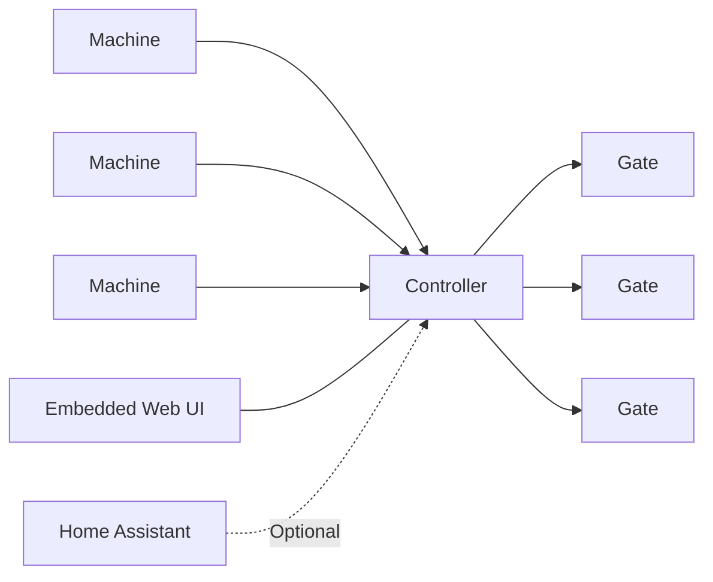

# System Architecture

## Components

### Controller

Responsibilities:

- routing
- configuration
- security
- event logging
- collector control
- web interface

The controller is the only component that makes decisions.

### Machine Node

Responsibilities:

- detect machine operation
- request extraction
- manual override
- diagnostics

A machine node never starts the collector.

### Gate Node

Responsibilities:

- open gate
- close gate
- report position
- diagnostics

A gate node never decides whether it should move.

### Home Assistant

Optional.

Used for:

- dashboards
- monitoring
- notifications

Never participates in real-time control.